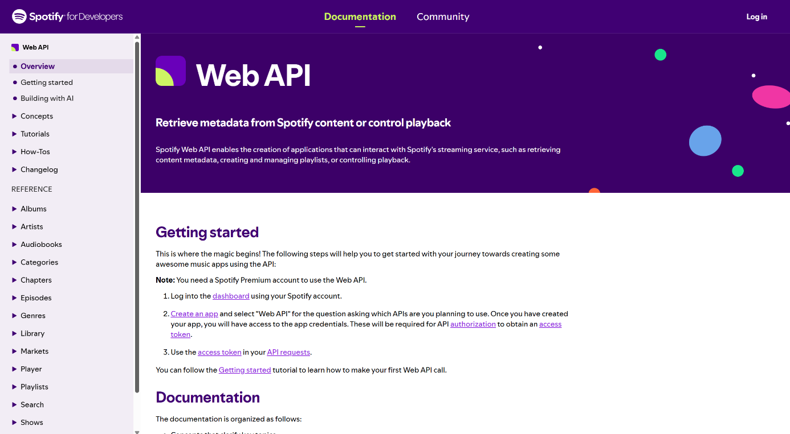
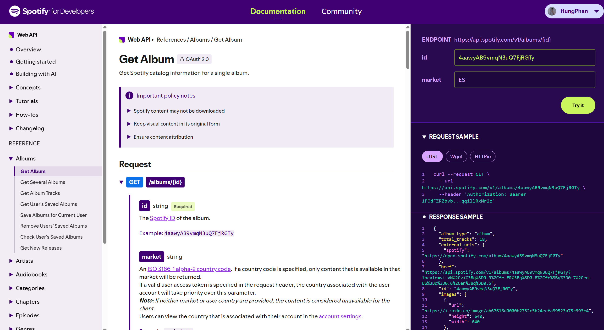
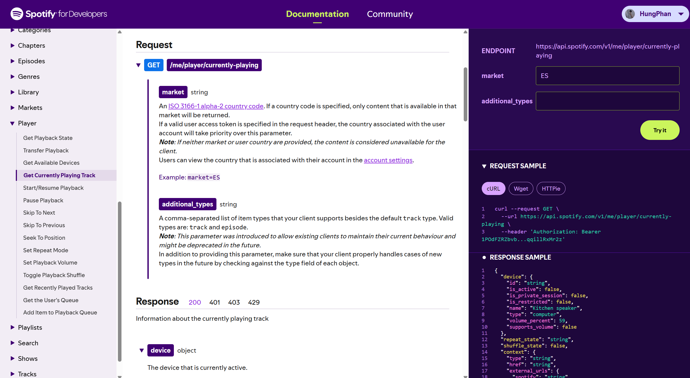
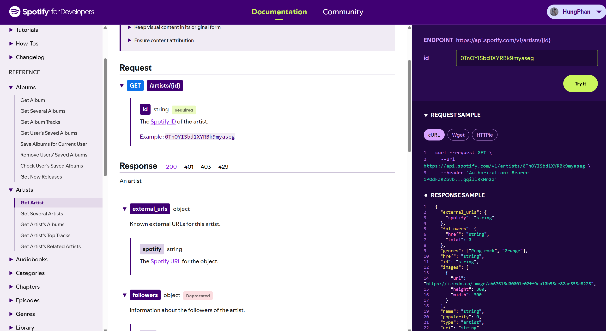
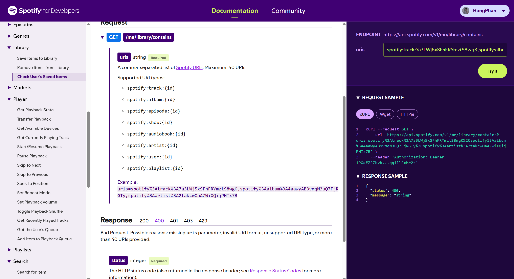

# Tóm tắt: Báo cáo Đánh giá Tiêu chuẩn Thiết kế RESTful API – Spotify Web API

> **Lưu ý:** Đây chỉ là bản tóm tắt. Muốn đọc đầy đủ nội dung (bảng khảo sát chi tiết, ví dụ request/response), vui lòng xem bản gốc **`Bao_cao_Spotify_Web_API.docx`**.

## Phân công nhóm

| STT | Họ và tên | MSV | Phụ trách |
|---|---|---|---|
| 1 | Nguyễn Phan Hùng | 21021503 | Tiêu chí 1–5: Tài nguyên là danh từ, Naming, Status code, Idempotency, Error response |
| 2 | Lã Việt Hoàng | 24021485 | Tiêu chí 6–9: Pagination, Filter/Sort, Authentication & security, Versioning & deprecation |

## Thông tin chung

- **Đối tượng:** Spotify Web API – `https://api.spotify.com/v1`
- **Phương pháp:** static review dựa trên tài liệu chính thức, changelog và ví dụ request/response (không triển khai ứng dụng thực tế).
- **Phiên bản đối chiếu:** tài liệu sau đợt thay đổi tháng 07/2026.
- **Thang đánh giá:** Đạt / Đạt một phần / Không đạt.
- **Bối cảnh:** từ 02/2026, Spotify thay đổi Web API ở Development Mode (bắt buộc Premium, gỡ/đổi tên nhiều endpoint, ví dụ `/playlists/{id}/tracks` → `/playlists/{id}/items`).

*Hình 1. Website Spotify for Developers*

## Kết quả tổng hợp

| # | Tiêu chí | Kết quả |
|---|---|---|
| 01 | Tài nguyên là danh từ | Đạt một phần |
| 02 | Naming nhất quán | Đạt |
| 03 | Status code đúng nghĩa | Đạt |
| 04 | Idempotency rõ ràng | Đạt một phần |
| 05 | Error response có cấu trúc | Đạt một phần |

## Điểm chính từng tiêu chí

### 01. Tài nguyên là danh từ (Đạt một phần)

- **Ưu điểm:** nhóm catalog (albums, artists, tracks…), playlist, library dùng danh từ và HTTP method đúng nghĩa.
- **Hạn chế:** nhóm Player mang phong cách RPC: `/me/player/play`, `/pause`, `/seek`, `/next`, `/previous`; `/me/library/contains` chứa động từ.
- **Đề xuất:** mô hình hóa player thành tài nguyên trạng thái, ví dụ `PATCH /v1/me/player` với body `{ "is_playing": false }`.

*Hình 2. Ví dụ cho `GET /albums/{id}`*

### 02. Naming nhất quán (Đạt)

- **Ưu điểm:** path viết thường, số nhiều, kebab-case (`/currently-playing`); query và JSON dùng snake_case; tên trường có hậu tố đơn vị (`duration_ms`).
- **Lưu ý:** lẫn `{id}` và `{playlist_id}`; cấu trúc `items.items.item` khó đọc; enum lẫn chữ thường và chữ hoa.

*Hình 3. Ví dụ cho path dạng kebab-case*

### 03. Status code đúng nghĩa (Đạt)

- **Ưu điểm:** dùng đúng 200/201/204/304/400/401/403/404/429/5xx; phân biệt rõ 401 và 403; không có trường hợp 200 kèm lỗi.
- **Lưu ý:** endpoint bị gỡ trả 403 thay vì 410 Gone/404, gây nhầm "thiếu quyền" với "không còn tồn tại".

*Hình 4. Response trả status 200 với request `GET /artists/{id}`*

*Hình 5. Response status 400 với request `GET /me/library/contains`*

### 04. Idempotency rõ ràng (Đạt một phần)

- **Ưu điểm:** phần lớn PUT/DELETE idempotent; `snapshot_id` giúp thao tác đúng phiên bản playlist.
- **Hạn chế:** không hỗ trợ `Idempotency-Key` cho POST, nên khi thử lại có thể tạo playlist/bài hát trùng.
- **Hạn chế:** sắp xếp lại playlist dùng PUT nhưng không idempotent; tài liệu không có mục riêng về idempotency.

### 05. Error response có cấu trúc (Đạt một phần)

- **Ưu điểm:** schema lỗi nhất quán, có `status` (trùng mã HTTP) và `message`.
- **Hạn chế:** không theo RFC 7807: dùng `application/json`, thiếu `type`, `title`, `instance`.
- **Hạn chế:** hai định dạng song song: `api.spotify.com` (`error` là object) và `accounts.spotify.com` theo OAuth 2.0 (`error` là chuỗi), buộc client phải viết hai bộ xử lý lỗi.

---

*Xem bản đầy đủ tại file `Bao_cao_Spotify_Web_API.docx`.*
