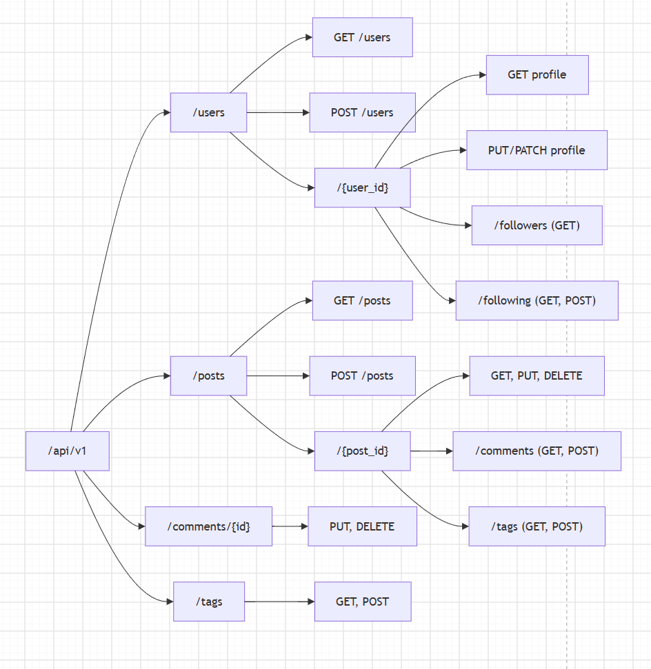

A.Resources chính   
- Users (Người dùng / Tác giả)   
- Posts (Bài viết)   
- Comments (Bình luận)   
- Tags (Thẻ phân loại)   
- Follows (Quan hệ theo dõi giữa các người dùng)

1. Collection Resource
Là danh sách hoặc tập hợp chứa nhiều đối tượng cùng một loại.
/posts: Danh sách toàn bộ bài viết.   
/users: Danh sách người dùng / tác giả.   
/tags: Danh sách tất cả các thẻ phân loại.   
2. Item Resource / Single Resource 
Là một đối tượng cụ thể duy nhất, được xác định thông qua định danh (ID) hoặc khóa chính.
/posts/{post_id}: Một bài viết cụ thể.   
/users/{user_id}: Hồ sơ một người dùng cụ thể.   
/tags/{tag_id}: Một thẻ phân loại cụ thể.   
/comments/{comment_id}: Một bình luận cụ thể (khi muốn thao tác trực tiếp như sửa/xóa).   
3. Sub-resource 
Là tài nguyên có quan hệ phụ thuộc chặt chẽ hoặc nằm bên trong vòng đời của một tài nguyên cha (Item Resource).   
/posts/{post_id}/comments: Danh sách các bình luận thuộc về bài viết {post_id}.   
/posts/{post_id}/tags: Các thẻ được gắn riêng cho bài viết {post_id}.   
/users/{user_id}/followers: Danh sách những người đang theo dõi người dùng {user_id}.   
/users/{user_id}/following: Danh sách những tác giả mà người dùng {user_id} đang theo dõi.   

B.Cây 
 
