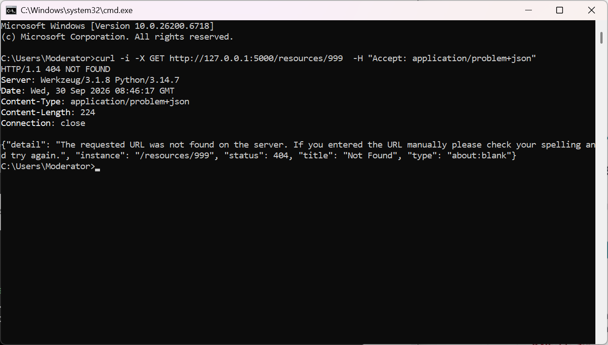
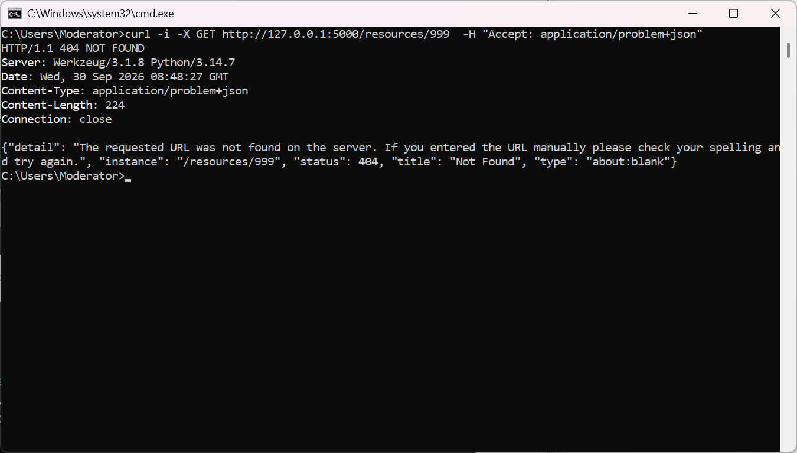
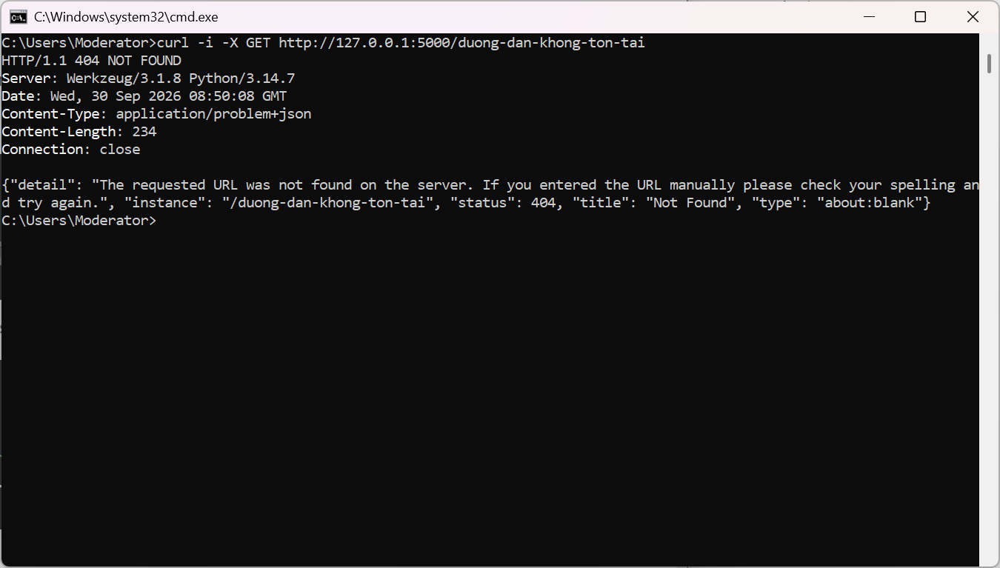

  
Truy vấn một resource không tồn tại (ID = 999).

  
  
Request kiểm thử khi client thiếu header Accept (hoặc Accept: application/json)

  
Request kiểm thử lỗi 404 mặc định từ framework (Fallback HTTPException)

  
Request kiểm thử lỗi 500 unhandled (Server Error)

