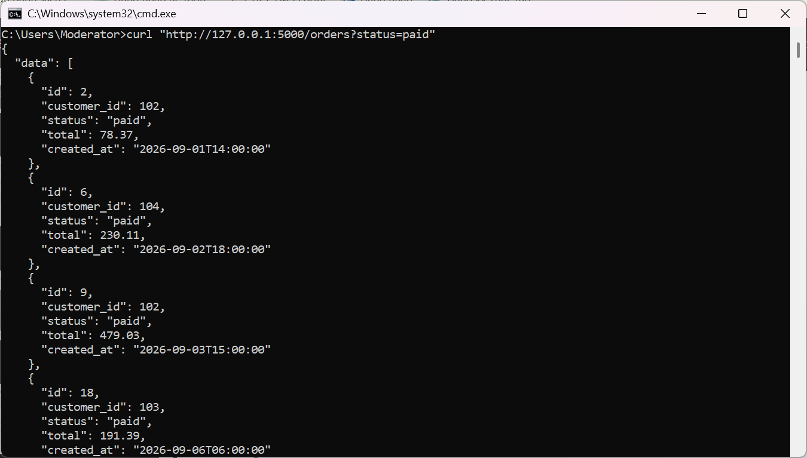
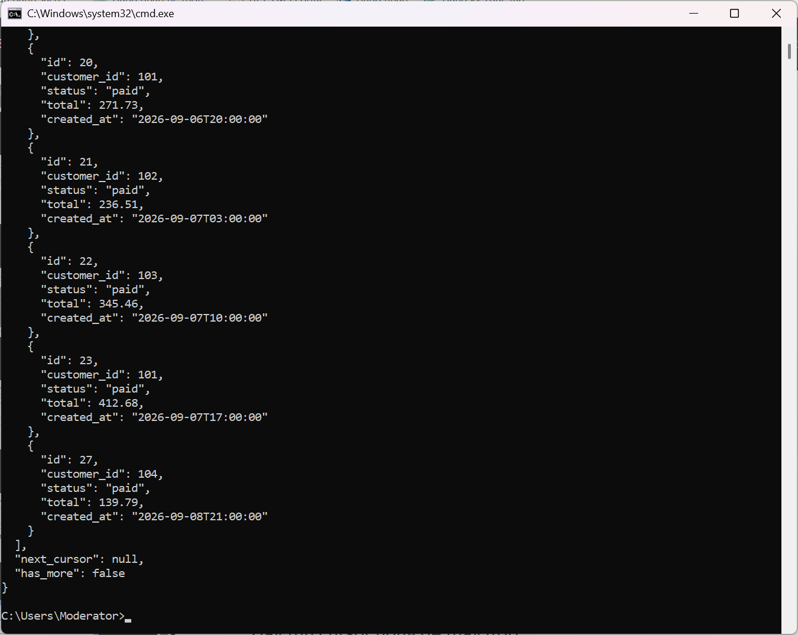
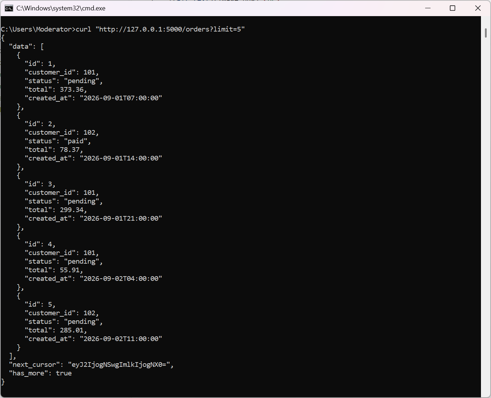
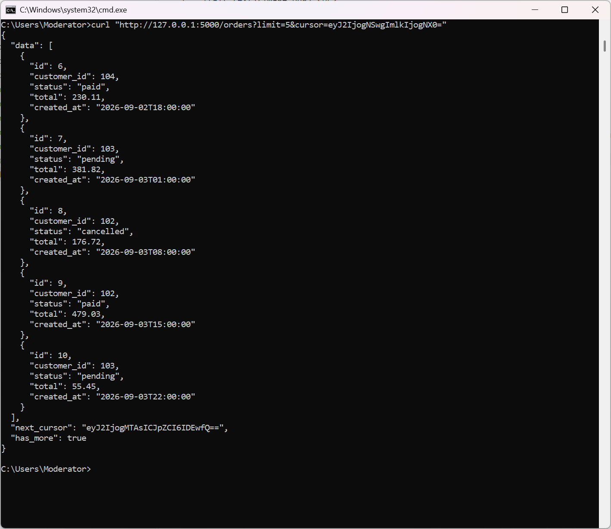
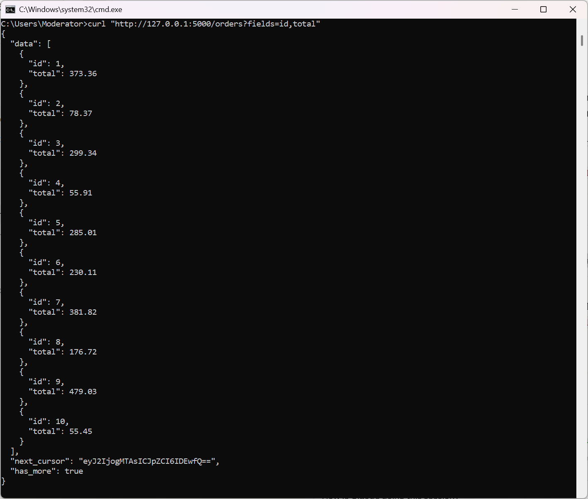
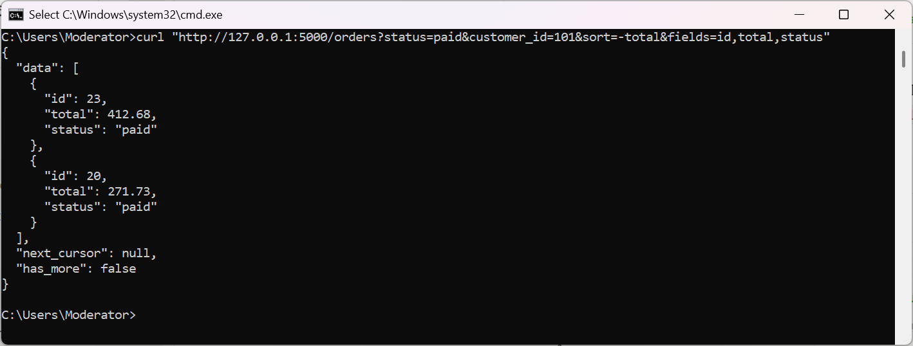
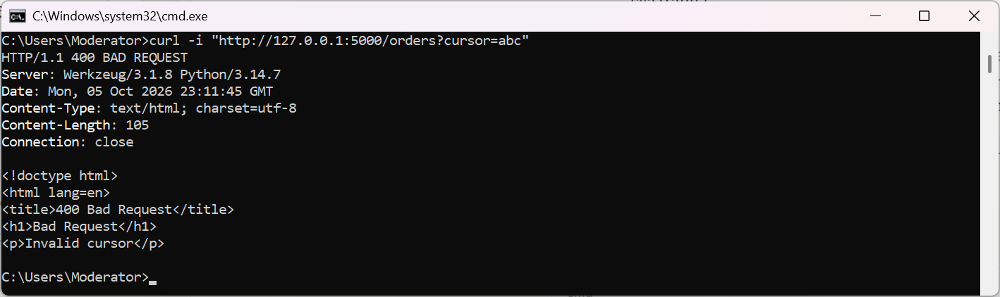

  
  
Request filter status = paid  

  
Pagination với limit = 5  

  
Pagination với limit = 5 và lấy trang thứ 2  

  
Sparse fieldsets: chỉ lấy field id, total  

  
Combination: Lấy đơn hàng status = paid của customer_id = 101, sắp xếp giá trị giảm dần và chỉ lấy field id, total, status  

  
Cursor error (400)

