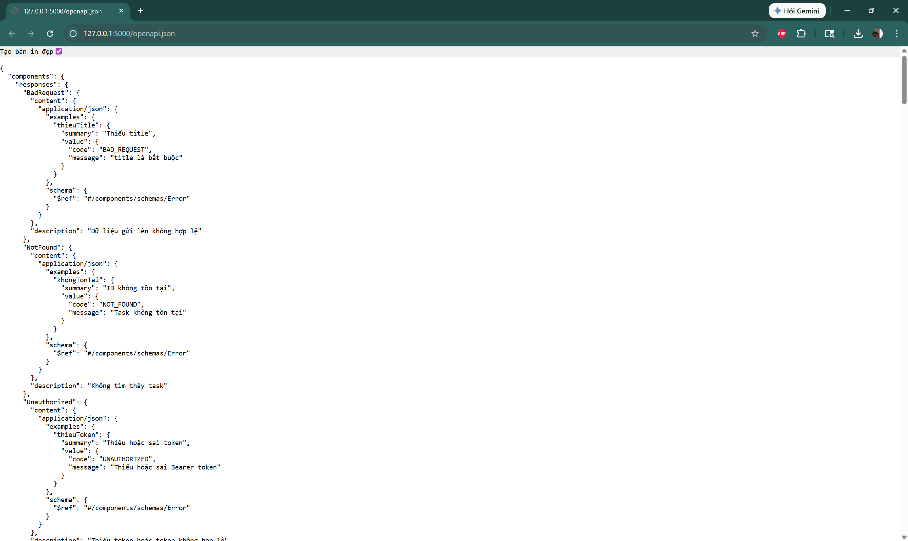
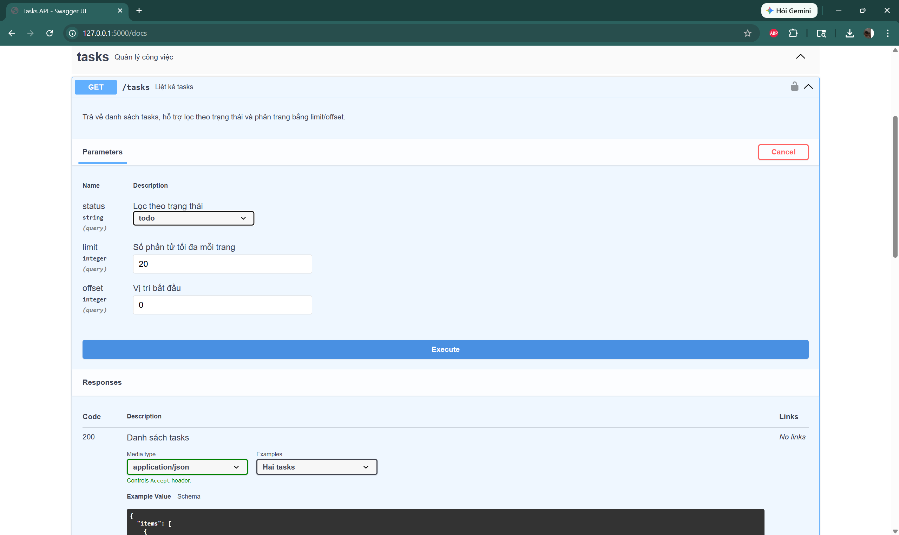
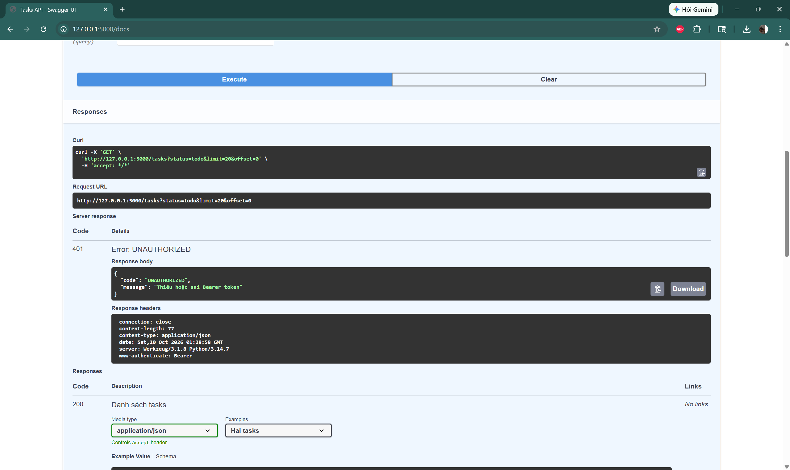
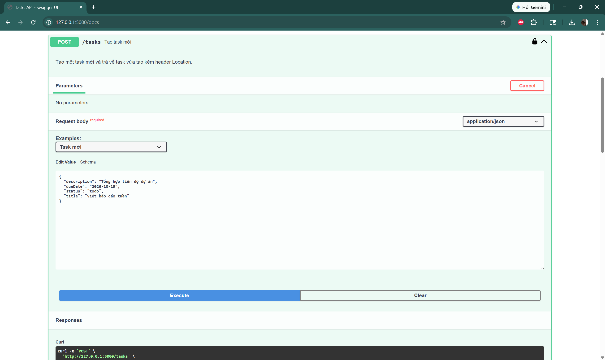
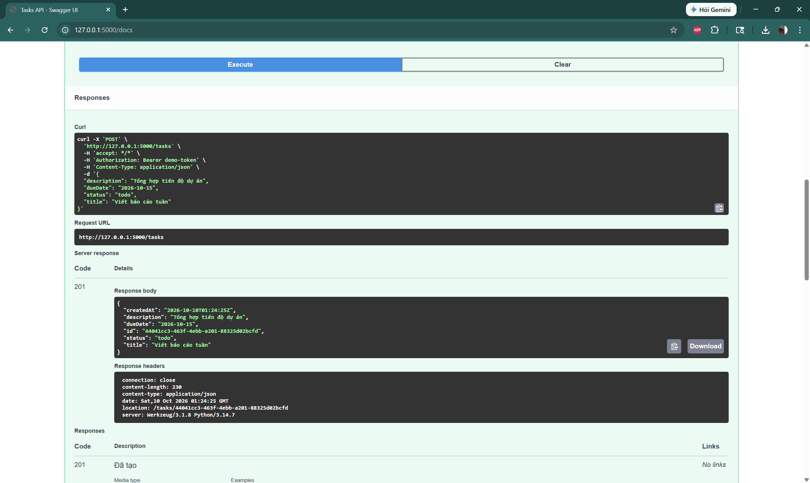

# Tasks API

Nguyễn Phan Hùng - 21021503

## Test Flask app

Ba trường hợp được kiểm tra trên server Flask chạy tại `http://127.0.0.1:5000`: lấy spec JSON, gọi GET và gọi POST.

### Case 1: JSON (`/openapi.json`)

*Hình 1. Truy cập `http://127.0.0.1:5000/openapi.json`, server trả về spec OpenAPI dạng JSON gồm `components`, `responses` (BadRequest, NotFound, Unauthorized) và các schema dùng chung.*

### Case 2: GET (`GET /tasks`)

*Hình 2. Trang `/docs` (Swagger UI) với endpoint `GET /tasks` ở chế độ Try it out, gồm các tham số `status`, `limit` và `offset`.*

*Hình 3. Bấm Execute khi chưa Authorize, server trả về mã 401 `UNAUTHORIZED` kèm header `www-authenticate: Bearer`, chứng tỏ endpoint được bảo vệ bằng Bearer token.*

### Case 3: POST (`POST /tasks`)

*Hình 4. Endpoint `POST /tasks` ở chế độ Try it out với request body mẫu (`title`, `description`, `status`, `dueDate`). Biểu tượng ổ khóa đã đóng, nghĩa là đã Authorize.*

*Hình 5. Sau khi Execute, server trả về mã 201 cùng task vừa tạo (có `id`, `createdAt`) và header `location: /tasks/{id}`. Lệnh curl hiển thị header `Authorization: Bearer demo-token` đã được gửi kèm.*

## Hai quyết định thiết kế khó nhất

### 1. Dùng PATCH và tách ba schema `Task`, `TaskCreate`, `TaskUpdate`

Khó nhất là chọn cách cập nhật. PUT yêu cầu client gửi cả task, nên hai người cùng sửa sẽ ghi đè lên nhau
và client phải biết hết các trường. Chọn PATCH: chỉ trường nào được gửi mới bị đổi, trường khác giữ nguyên.

Để làm được điều đó phải tách schema thay vì dùng chung một `Task`:

- `Task` (response): có `id` và `createdAt` do server sinh ra.
- `TaskCreate`: bắt buộc `title`, `status` mặc định `todo`.
- `TaskUpdate`: mọi trường đều tùy chọn nhưng phải có ít nhất một (`minProperties: 1`).

Cả hai schema đầu vào đều có `additionalProperties: false`. Nếu client gửi `id` hoặc `createdAt`, server trả 400
thay vì bỏ qua, vì bỏ qua sẽ làm client tưởng mình đã đổi được id.

Đánh đổi: PATCH không cho phép "xóa" một trường tùy chọn (ví dụ bỏ `dueDate`), vì chưa hỗ trợ giá trị `null`.

### 2. Một định dạng lỗi duy nhất và phân trang bằng limit/offset

Mọi lỗi (400, 401, 404, 405, 500) đều trả cùng một dạng `{ "code": "NOT_FOUND", "message": "..." }`, khai báo một lần
trong `components/responses` rồi dùng lại bằng `$ref`. Ở Flask, đăng ký error handler cho cả lỗi mặc định
của Werkzeug, nên ngay cả đường dẫn không tồn tại cũng trả JSON thay vì HTML. Client chỉ cần một đoạn xử lý lỗi.
`code` là chuỗi ổn định để code so sánh, còn `message` dành cho người đọc nên có thể đổi lời mà không phá client.
Chọn `code` dạng chuỗi thay vì lấy số HTTP vì số đã nằm sẵn ở status line.

Phân trang chọn `limit`/`offset` (mặc định 20, tối đa 100) cùng trường `total`, vì dễ hiểu và dễ thử bằng
Try it out. Đánh đổi là khi dữ liệu thay đổi giữa hai lần gọi, client có thể thấy trùng hoặc sót phần tử.
Phân trang bằng cursor sẽ chính xác hơn, nhưng phức tạp hơn nhiều, là hướng cải tiến khi dùng cho dữ liệu lớn.
